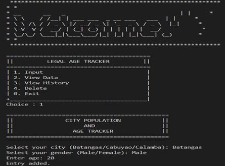
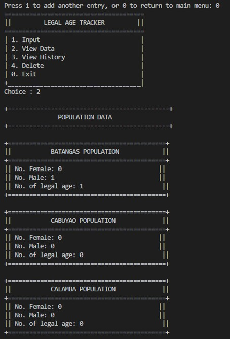
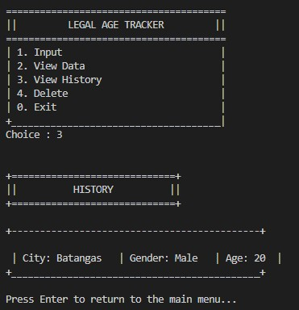
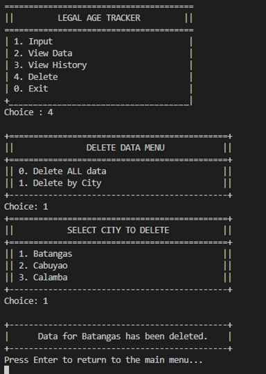
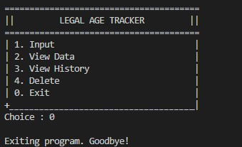

# TITLE	 - P.A.T. (Population Age Tracker)  

## DESCRIPTION/OVERVIEW 

The Legal Age Tracker is a Java-based console application created to help users record personal information and quickly determine whether an individual meets the legal age requirement. Its main purpose is to provide a simple and organized way to manage age-related records, which are often needed for verification, monitoring, or basic demographic tracking. Manually checking ages or keeping records on paper can be inefficient, error-prone, and difficult to organize over time. This program solves that problem by allowing users to input details such as name, age, gender, and city, automatically evaluating legal age status and storing entries for later review. With features for viewing history and generating basic statistics, the application makes age tracking more accurate, structured, and easy to manage.

***

## OOP CONCEPTS APPLIED
**ENCAPSULATION**
Encapsulation protects data by restricting direct access to class variables and allowing interaction only through methods.

**EXCEPTION HANDLING**
Handles runtime errors gracefully without crashing the program.

***

## PROGRAM STRUCTURE

- **LegalAgeTracker** – Entry point of the program; handles menu display, user interaction, and controls the overall program flow
- **Entry** – Represents an individual record containing personal information such as name, age, gender, and city
- **History** – Manages the collection of user entries; responsible for adding, deleting, and displaying stored records
- **Stats** – Processes and displays statistical information based on the recorded entries, such as age distribution and population data

***

## HOW TO RUN THE PROGRAM

- Java Development Kit (JDK) version 8 or later is required to compile and run the program.
- Any Java IDE such as IntelliJ IDEA, Eclipse, or NetBeans may be used, or the program may be run using a Command Prompt or Terminal.
- Ensure that the project folder contains all required Java source files.
- Compile the program using the Java compiler.
- Run the program from the terminal or IDE.

***

## SAMPLE OUTPUT

### Main Menu

### Input Data

### Population Statistics

### View History

### Delete Records

***

## AUTHOR AND ACKNOWLEDGEMENT

-	ESTIGOY, NIEL P.
-	ORLINA, NATHANIEL MARI G.
-	SIMARA, JOHN PATRICK A.
  
***

### OTHER SECTIONS 

**Improvements /Author Suggestions**

In the future, the Legal Age Tracker can be improved by adding a database so records can be saved permanently instead of being lost when the program closes. A graphical user interface (GUI) may also be added to make the system easier and more user-friendly. More cities and demographic options can be included to allow wider population tracking. The program can also be enhanced by adding charts or graphs to better visualize population data. Lastly, security features such as user login and access control can be implemented to help protect sensitive information.
